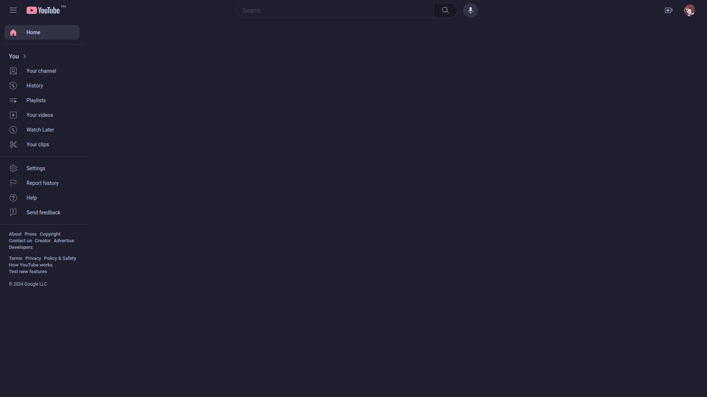
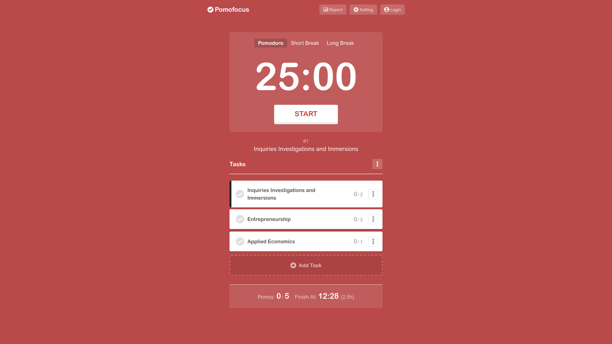

+++
title = 'Instant Gratification, Overstimulation, and Brainrot'
date = 2024-02-25T08:54:58+08:00
draft = false
tags = ["self-improvement"]
+++

I'm gonna be talking about instant gratification, its negative effects, and the things you can do to combat it.

<!--more-->

## My Experience

I consume _way_ too much "internet". Not speaking in the bandwidth sense, but in the
sense that I spend a lot of my time on sites like Youtube, Discord, and Instagram.

And it's not limited to social-media sites only. Sometimes I would spend _hours_
deathscrolling through sites like Pinterest, Twitter, and Reddit. I wouldn't get bored of it too,
__I ignored the work I needed to do, because I chose instant gratification.__

Hours and hours -- and sometimes a full day -- would go by without me realizing it.

<!-- Naturally, overdue assignments would build up, and there were many days where -->
<!-- I just completely skip school because my brain was too stimulated and tired from -->
<!-- all the "consuming" I had been doing. -->

All of this gradually dulled my attention-span and ability to focus, which is everything to me as a student. I also started to feel like a 
lesser human, cause I wasn't being as efficient when it came to learning 
or being productive.

## Why write about this?
This post might seem a little vent-y, but I write about this because I want to remind myself and kind of acknowledge that it is a problem. (it has been for a long time, personally)

The more we try our best to avoid instant gratification, the more clear our mind is, and as a result improves focus. Taking those steps to kind of set up guardrails around distractions can help build healthy habits, and break bad habits.

## Things that help me stay productive

### Unhook
Browser extensions like [unhook](https://addons.mozilla.org/en-US/firefox/addon/youtube-recommended-videos/) allow you to hide YouTube's recommended section, making it significantly harder to get distracted unless
you deliberately choose to do so. (see screenshot below)

Unhook has options to disable the subscriptions, comments, and even the Youtube shorts buttons.

There are also other web-extensions that can block websites during a specific period of time. (I wont list any here, because I personally didn't see the need for them yet)

### pomofocus.io
I think that the [pomodoro](https://en.wikipedia.org/wiki/Pomodoro_Technique) is a great productivity system. It allows your work to be more focused, and your breaks to be effective.

[pomofocus.io](https://pomofocus.io) allows you to define tasks that can be completed through pomodoro intervals. You can even set custom intervals and work/break times to suit your preference.

### Have a list of stuff you wanna learn or do
If you're a programmer like me, having a list of technologies you want to learn keeps you organized and on track. 

- Sit down and think about what field of programming you want to get into, be it front-end development, data-science, or whatever. 
- Make a list of new technologies you want to learn, relative to the field you wish to explore.
    - This could be a programming language, a new JavaScript framework, a skill like UI Design or database management, etc
- Set your goals according to the list of technologies you want to learn 
    - If you want to dip your toes in C++, an example goal would be to: finish 4hr introductory course on YT about C++
