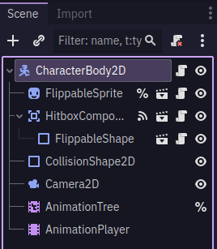
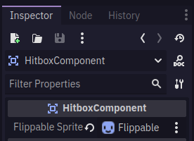
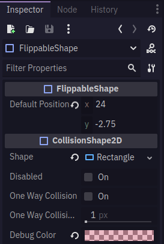
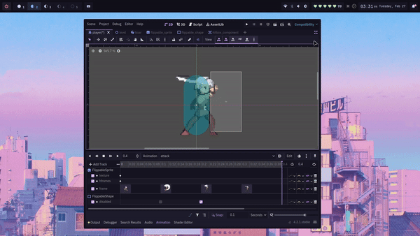

+++
title = 'Proper Collision Shape Flipping in Godot 4'
date = 2024-02-27T10:42:13+08:00
draft = true
tags = ["godot","game-development"]
categories = ["tutorial", "youtube-video"]
+++

I made a Youtube Tutorial on how to implement a *Hitbox Flipping* mechanic in Godot. See embedded video below:



A GitHub repository for this project is also available:


## Implementation
I used a **composition-based** approach to implement the Hitbox Flipping. By utilizing composition, we're able to define scenes called **"components"**, that we will later be able to reuse in other scenes: the player scene, any enemy scene, or even traps that need to be flipped.

> To implement *Hitbox Flipping*, we need to define 3 new scenes, each with one node only.

### Flippable Sprite Component
> The job of this component is to notify any [Flippable Collision Shapes]({})
whenever the sprite is flipped, so that the Flippable Collision Shapes can update their positions and flip as well.

Make a new scene with the root node being a `Sprite2D`. Rename the `Sprite2D` to `FlippableSprite`. Save the scene anywhere as `flippable_sprite.tscn`

Attach a script to your newly renamed `FlippableSprite` node. Save it anywhere as `flippable_sprite.gd`
```gdscript
# flippable_sprite.gd

extends Sprite2D
class_name FlippableSprite

signal sprite_flipped(flip_value)

var flipped: bool = false:
	set(new_value):
		if new_value != flipped:
			flipped = new_value
			flip_h = flipped
			sprite_flipped.emit(new_value)
```

In the script, we define a new signal called `sprite_flipped(flip_value)`. This signal will be emitted in our setter function, `set(new_value)`, whenever the value of our variable `flipped` is set. (you can read more about Godot 4 setters and getters [here](https://shaggydev.com/2022/01/04/setget/))

In our setter function, we set the value of the variable `flipped` to the new flip value, and we also set the value of `Sprite2D`'s property `flip_h` to the new flip value

### Flippable Collision Shape Component
> This component will listen to the signal `sprite_flipped(flipped_value)` that we defined earlier in [Flippable Sprite Component]({})

Make a new scene with the root node being a `CollisionShape2D`. Rename the `CollisionShape2D` to `FlippableShape`. Save the scene anywhere as `flippable_shape.tscn`.

> The `FlippableShape` node will throw 2 errors. Ignore them, as we'll resolve these errors later on by initializing this scene as a child of a parent HitboxComponent scene and giving it a shape.

Attach a script to your newly renamed `FlippableShape` node. Save it anywhere as `flippable_shape.gd`

```gdscript
# flippable_shape.gd

extends CollisionShape2D
class_name FlippableShape

@export var default_position: Vector2:
	set(new_position):
		default_position = new_position
		position = new_position

var current_flip_value: bool

func _on_sprite_flipped(flip_value):
	if current_flip_value != flip_value:
		default_position.x *= -1
		current_flip_value = flip_value
```

Our function `_on_sprite_flipped(flip_value)` will be called everytime the signal `sprite_flipped(flip_value)` is emitted.

To get the flip, we multiply `default_position.x` by `-1`, this mirrors the position to the other side. 

> For example, let's say `default_position.x` is `20`. By doing `default_position.x *= -1`, `20` becomes `-20`; it flips as a result.

### Hitbox Component
> This component will serve to connect the `sprite_flipped` signal from our [Flippable Sprite Component]({}) to the function `_on_sprite_flipped(flip_value)` that will flip the [Flippable Shape Component]({})


Make a new scene with the root node being a `Area2D`. Rename the `Area2D` to `HitboxComponent`. Save the scene anywhere as `hitbox_component.tscn`.


Attach a script to your newly renamed `HitboxComponent` node. Save it anywhere as `hitbox_component.gd`

```gdscript
# hitbox_component.gd

extends Area2D
class_name HitboxComponent

@export var flippable_sprite: FlippableSprite

func _ready():
	if flippable_sprite != null:
		for child in get_children():
			flippable_sprite.sprite_flipped.connect(child._on_sprite_flipped)
			child.disabled = true
```

> Don't forget to set a FlippableSprite for the `flippable_sprite` export var that we defined

we set `child.disabled = true` so that we don't have an active hitbox when the parent scene is added to the scene tree. For example: we don't want the player starting off with an active hitbox even though we haven't pressed the attack button.

You can then connect `HitboxComponent`'s `body_entered(body: Node2D)` signal to a function that deals damage to any class that can take damage, like the player, enemy, or breakable items like pots.

## Usage
Any scene that you want to have *hitbox flipping* should have the 3 scenes defined above as its children: 
[FlippableSprite]({}), 
[FlippableShape]({}), 
and [HitboxComponent]({})

An example implementation:



> Don't forget to set a `FlippableSprite` node for the `flippable_sprite` export var that we defined in `HitboxComponent`:



> Don't forget to set a `shape` and `default_position` for your `FlippableShape`:



> Don't forget to set `FlippableShape`'s `disabled` property to `true` during the active frames, and `false` during the inactive frames of your attack animation.

